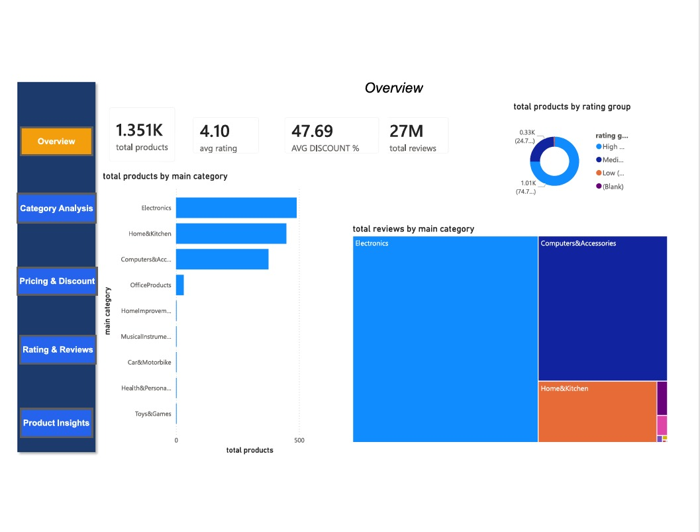
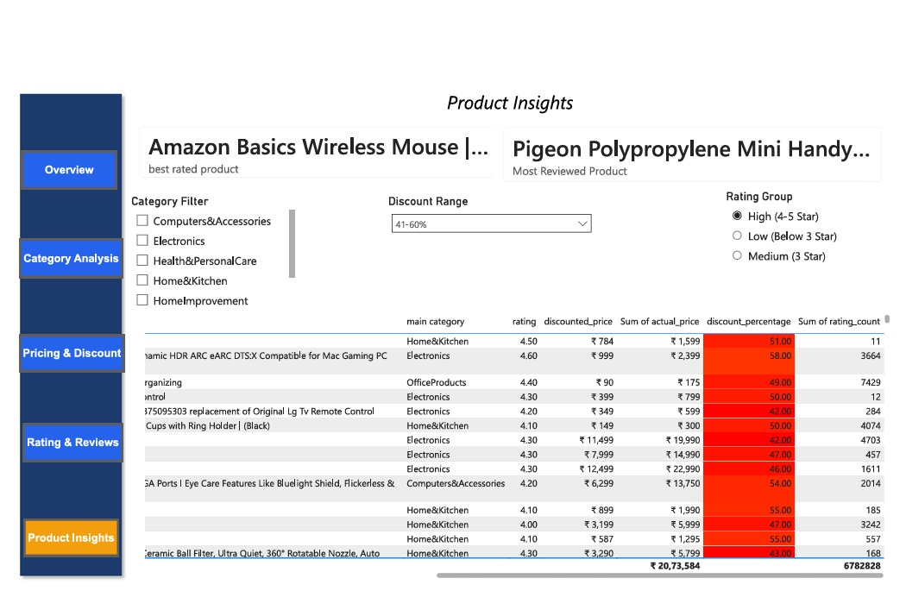

# Amazon Product Analysis Dashboard

## Project Overview
Developed an end-to-end Amazon Product Analysis project using Python and Power BI. Cleaned and transformed raw data, performed Exploratory Data Analysis (EDA), and analyzed product prices, discounts, ratings, reviews, and category-wise performance. Built an interactive Power BI dashboard with KPIs, filters, and visualizations to provide actionable business insights.

## Tools & Technologies
- Python
- Pandas
- NumPy
- Power BI
- Data Cleaning
- Data Visualization
- EDA

## Dashboard Screenshots

## Dashboard Overview

## Rating & Overview Analysis

## Pricing & Discount Analysis

## Category Analysis

## Product Insights

## Key Insights
- Identified top-rated products across categories.
- Analyzed discount impact on product ratings.
- Compared category-wise pricing and customer reviews.
- Created interactive filters for dynamic analysis.
